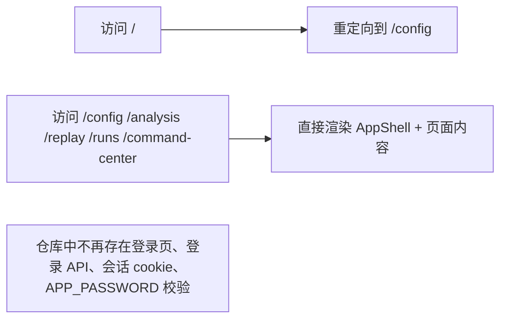

# Coin Hub 移除登录设计

**目标：** 移除 Coin Hub 的单用户登录、会话和权限校验逻辑，让系统默认直接进入控制台，仓库中不再保留“登录”概念。

## 变更范围

- 根路由 `/` 不再读取 cookie，直接跳转到 `/config`。
- `src/app/(protected)/layout.tsx` 去掉权限拦截，仅保留壳层布局职责。
- 删除登录页、登录/登出 API、认证服务和 `APP_PASSWORD` 环境依赖。
- 顶部壳层移除“退出登录”按钮。
- 更新自动化测试，使 E2E 直接访问控制台页面。
- 更新 README 与操作手册，去掉登录和密码相关说明。

## 非目标

- 不新增新的权限模型。
- 不重构现有业务页面和 API 的主体行为。
- 不改变 worker、数据库和任务处理逻辑。

## 目标状态

## 设计说明

### 路由与壳层

当前登录体系把根路由、`(protected)` 布局和壳层按钮串成一条鉴权链。移除后，首页只负责把用户导向配置页；受保护布局不再校验身份，变成纯布局容器；壳层只展示产品标识和内容区域，不再暴露退出动作。

### 认证代码与环境变量

`auth-service`、登录页和 `/api/auth/*` 在目标状态下会变成纯死代码，应该整体删除，而不是保留“恒为通过”的空壳。`APP_PASSWORD` 同时从运行时环境要求中移除，避免本地开发、测试和部署继续被无意义配置阻塞。

### 测试策略

原有 E2E 大多先登录再进入业务页面，新的验证应改成“直接进入页面并完成业务动作”。这能更贴近真实行为，也能避免仓库里继续维护一套已经不存在的登录前置步骤。只验证鉴权逻辑的测试会删除或替换成入口跳转、壳层展示这类现状测试。

## 风险与控制

- 风险：删掉登录后，若仍有页面或测试引用 `/login`，会产生 404 或失败。
  控制：先改测试为免登录访问，再删除相关实现并全量搜索残留引用。
- 风险：`APP_PASSWORD` 仍被环境校验依赖，导致启动或测试失败。
  控制：同步调整 `src/lib/env.ts` 和文档，确保运行时不再读取该变量。
- 风险：顶部壳层文案测试仍断言“退出登录”。
  控制：同步更新单元测试断言，改为验证核心导航文案仍存在。
