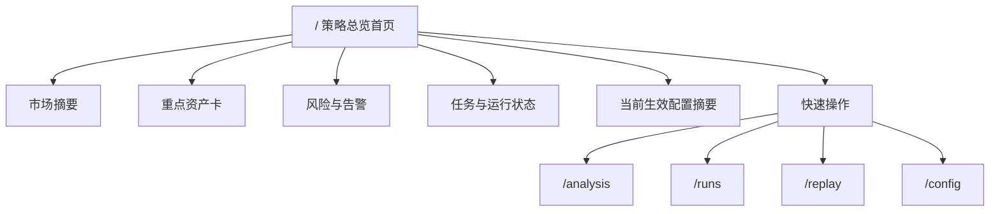
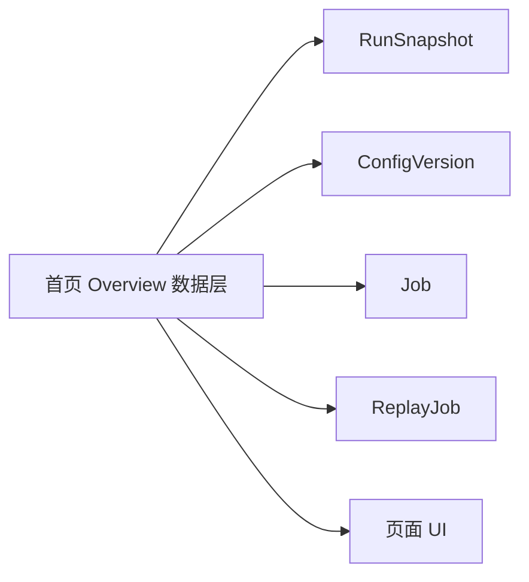

# 策略控制台首页改造轻量 Spec

## 1. 背景

当前项目已经具备配置管理、运行快照、回放记录、任务队列与分析研究页等模块，但默认首屏仍然落在配置管理，导致用户进入系统后首先看到的是参数编辑，而不是策略判断、风险状态和待处理事项。

这次改造的目标不是重写策略引擎，而是先把产品入口和信息架构扶正：把 `/` 调整为真正的“策略控制台首页”，让首页先回答“现在发生了什么、风险在哪里、下一步该做什么”，再把配置、研究、回放、运行历史作为二级工作区。

## 2. 现状分析

### 2.1 当前默认入口不适合作为策略控制台首页

- 根路由 `HomePage` 当前直接重定向到 `/config`，因此用户进入系统后会先看到配置页，而不是策略总览。  
  出处：`src/app/page.tsx` / `HomePage`

- `AppShell` 当前只提供标题区，没有导航、没有全局状态摘要、没有模块入口，因此不同工作区之间缺少统一的控制台骨架。  
  出处：`src/components/app-shell/app-shell.tsx` / `AppShell`

### 2.2 现有页面已有部分可用信息，但被分散在二级页面

- `ConfigPage` 通过 `getConfigVersionData` 展示当前生效版本和历史版本；`ConfigEditor` 提供创建版本与切换生效版本的能力，但内容只围绕配置参数，不提供策略判断信息。  
  出处：`src/app/(protected)/config/page.tsx` / `ConfigPage`  
  出处：`src/components/config/config-editor.tsx` / `ConfigEditor`

- `CommandCenterDashboard` 已能读取最新 run 结果并支持手动触发分析任务，因此它已经包含首页所需的一部分真实可用数据。  
  出处：`src/components/command-center/command-center-dashboard.tsx` / `CommandCenterDashboard`

- `/api/dashboard` 会优先返回最新持久化的 `runSnapshot`；若没有快照，则临时触发一次 `runDualAssetAnalysis`。这说明当前项目已经存在“最新运行结果”的统一来源。  
  出处：`src/app/api/dashboard/route.ts` / `getLatestRunResult`

- `RunsPage` 已支持查看运行快照列表与详情；`ReplayPage` 已支持展示 replay 历史与摘要，因此“审计历史”和“验证历史”并不是缺失，而是没有被整合到首页。  
  出处：`src/app/(protected)/runs/page.tsx` / `RunsPage`  
  出处：`src/app/(protected)/replay/page.tsx` / `ReplayPage`

### 2.3 分析研究页目前不适合作为首页主依据

- `loadAnalysisPayload` 当前使用 `buildDemoCandles` 和 `buildDemoRawTweets` 生成研究数据，并明确标注“当前展示的是演示研究切片”“暂未接入实时市场数据仓库”。这意味着分析页当前更适合作为演示研究页，而不是首页总览的权威来源。  
  出处：`src/components/analysis/analysis-data.ts` / `buildDemoCandles`  
  出处：`src/components/analysis/analysis-data.ts` / `buildDemoRawTweets`  
  出处：`src/components/analysis/analysis-data.ts` / `loadAnalysisPayload`

### 2.4 数据底座已经具备首页聚合的基础

- Prisma 模型中已经存在 `ConfigVersion`、`Job`、`RunSnapshot`、`ReplayJob`、`Candle`、`Tweet`、`AttributedViewpoint`，说明首页可先基于现有表做聚合，不必等待策略引擎重构完成。  
  出处：`prisma/schema.prisma`

## 3. 设计结论

本次首页改造采用 **C. 双层结构**：

- `/` 作为“策略总览首页”
- `/analysis` 作为“研究工作台”
- `/runs` 作为“运行审计页”
- `/replay` 作为“历史验证页”
- `/config` 作为“配置管理页”

首页负责“决策前总览”，二级页负责“深入查看与操作”。

### 3.1 首页口径约定

为避免首页出现两套“版本”概念，本次首页统一使用以下命名：

- **运行策略版本**：指最新一次 `runSnapshot.strategyVersion`
- **生效配置版本**：指当前 active `ConfigVersion`

首页顶部摘要中的“版本”默认指 **运行策略版本**；配置区块中的“版本”默认指 **生效配置版本**。两者允许不同步展示，但必须分别命名，不能混用“当前版本”这种模糊文案。



## 4. 首页信息架构

首页必须展示以下 6 块信息：

### 4.1 市场摘要

展示最新一次运行的总体判断，至少包括：

- 运行策略版本（来自最新 `runSnapshot.strategyVersion`）
- BTC / ETH 当前状态概览
- 最新运行时间
- 是否存在降级资产

### 4.2 重点资产卡

首页至少展示 BTC、ETH 两张卡片，每张卡片包含：

- 状态
- 置信度
- 核心证据 2 到 3 条
- 进入研究页或运行详情的入口

首页第一阶段不新增复杂证据派生规则，重点资产卡的证据直接复用最新 `runSnapshot.assetsJson` 中对应资产的 `evidence` 数组，按顺序截取前 3 条；如果为空，则展示“暂无证据摘要”空状态，不从 `warnings` 反推资产证据。

### 4.3 风险与告警

首页单独突出所有影响决策优先级的异常信息，包括：

- 当前 warnings
- degraded assets
- 最近失败任务或异常任务

其中：

- **当前 warnings**：来自最新 `runSnapshot.warningsJson`
- **degraded assets**：来自最新 `runSnapshot.degradedAssetsJson`
- **最近失败任务**：取最近 5 条 `Job.status = failed` 的任务，按 `completedAt` 倒序；若 `completedAt` 为空，则按 `createdAt` 倒序

### 4.4 任务与运行状态

首页展示系统执行状态，至少包括：

- 最近一次运行状态
- 当前队列中的任务数量
- 最近 replay 数量
- 最近 run 数量

其中统计口径统一如下：

- **最近一次运行状态**：按最新 `RunSnapshot.createdAt` 对应记录展示
- **当前队列中的任务数量**：统计 `Job.status in ('queued', 'processing')`
- **最近 replay 数量**：统计最近 24 小时内创建的 `ReplayJob`
- **最近 run 数量**：统计最近 24 小时内创建的 `RunSnapshot`

### 4.5 当前生效配置摘要

首页只展示配置摘要，不直接承载表单编辑：

- 生效配置版本名称
- `riskPct`
- 版本 ID
- 进入配置页入口

### 4.6 快速操作

首页需要提供直接动作入口：

- 运行分析
- 查看研究工作台
- 提交 replay
- 进入配置管理

## 5. 数据来源策略

首页第一版以 **现有真实可用数据优先** 为原则，不等待完整策略重构。

### 5.1 首页第一版可直接复用的数据

- 最新运行结果：来自 `runSnapshot` 或现有 `/api/dashboard`
- 生效配置摘要：来自当前 active `ConfigVersion`
- 任务状态：来自 `Job`
- 回放摘要：来自 `ReplayJob`

### 5.2 首页第一版暂不依赖的数据

- `analysis` 页面里的 demo K 线、demo tweet、demo signal
- 尚未真正接入 active config 的策略参数结果
- 尚未统一口径的研究工作台细节

### 5.3 推荐聚合方式

不建议首页前端分别请求多个接口后自行拼接，而应提供一个专门的首页聚合数据层，统一返回首页所需 payload，减少页面碎片化 loading 与口径不一致的问题。

### 5.4 首页聚合数据最小 Schema

首页第一阶段推荐返回以下最小聚合结构：

```ts
type OverviewPayload = {
  marketSummary: {
    strategyVersion: string | null;
    latestRunAt: string | null;
    degradedAssets: string[];
    warnings: string[];
  };
  assets: Array<{
    symbol: "BTC" | "ETH";
    status: string;
    confidence: number | null;
    evidence: string[];
  }>;
  operations: {
    queuedJobCount: number;
    recentRunCount24h: number;
    recentReplayCount24h: number;
    recentFailedJobs: Array<{
      id: string;
      type: string;
      error: string | null;
      createdAt: string;
      completedAt: string | null;
    }>;
  };
  activeConfig: {
    summary: string | null;
    riskPct: number | null;
    versionId: string | null;
  };
};
```

### 5.5 空状态与异常展示原则

- 如果没有任何 `RunSnapshot`，首页仍然展示完整布局，但市场摘要显示“暂无运行快照”，重点资产卡显示空状态，并保留“运行分析”快速操作
- 如果没有 active `ConfigVersion`，配置摘要显示“暂无生效配置”，并引导进入配置页
- 如果任务、回放、运行计数为 0，应展示明确的 `0`，不隐藏模块
- 如果首页聚合接口部分字段缺失，页面优先展示已有信息，不因为单个区块为空而整页失败



## 6. 页面角色调整

### 6.1 `/`

从“重定向到配置页”改为“策略总览首页”。

### 6.2 `/config`

保留为配置管理工具页，不再承担首页职责。

### 6.3 `/analysis`

继续作为研究工作台，但在第一阶段不要求其成为首页数据源。

### 6.4 `/runs`

继续作为运行审计页，承接首页跳转。

### 6.5 `/replay`

继续作为历史验证页，承接首页跳转。

## 7. 范围边界

### 7.1 本次必须完成

- 新首页信息架构
- 应用外壳导航改造
- 首页聚合可用信息
- 根路由切换到首页
- 原配置页降级为二级页

### 7.2 本次明确不做

- 重写完整策略引擎
- 把分析研究页全量替换成真实数据
- 做多用户或权限体系
- 做复杂图表能力扩展

## 8. 风险与决策

### 8.1 首页聚合接口不足

现有 `/api/dashboard` 只覆盖“最新 run 结果”，不足以直接承载首页全部信息，因此大概率需要新增专门的首页聚合服务或接口。

### 8.2 首页与研究页口径暂时不一致

首页第一版如果基于 `runSnapshot`，而研究页仍然基于 demo 数据，则两者存在口径差异。第一阶段需要通过页面定位和文案避免误导，第二阶段再推进数据源统一。

### 8.3 真实数据深度有限，但不阻碍首页上线

即使策略引擎当前仍较简单，只要首页能把“已有真实结果、已有历史、已有任务状态”组织清楚，它依然会比现状显著更接近一个策略控制台。

## 9. 验收标准

当以下条件满足时，可认为第一阶段首页改造达标：

- 用户访问 `/` 时进入策略总览首页，而不是配置页
- 首页能在一个屏幕内看见市场摘要、重点资产、风险、任务状态、配置摘要和快速操作
- 用户可从首页进入研究、运行历史、回放、配置四个二级工作区
- 首页展示的数据以现有真实可用数据为主，而不是 demo 研究数据
- 配置页仍保留现有配置版本管理能力

## 10. 后续阶段建议

首页信息架构改造完成后，建议第二阶段继续推进：

1. 把 active config 真正接入 `run-orchestrator`
2. 把 Candle / Tweet / AttributedViewpoint 接进统一分析链路
3. 统一首页与研究页的数据口径
4. 再决定是否增强图表研究体验
