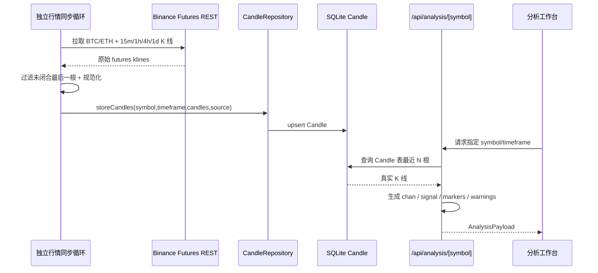

# Binance Futures 合约 K 线接入轻量 Spec

## 1. 目标

- 将当前分析工作台从演示 K 线切换为 **Binance USDⓈ-M Futures** 的真实合约 K 线
- 保持当前研究范围不扩散，第一阶段只支持 `BTCUSDT`、`ETHUSDT` 与 `15m / 1h / 4h / 1d`
- 采用 **方案 B：Binance Futures REST + 独立定时同步 + 分析页真实读库**
- 不把行情同步塞进现有 `Job` 队列，避免污染首页和运行面板的操作统计

## 2. 当前现状

### 2.1 已有真实行情雏形，但来源和使用链路还没闭合

- 当前市场数据采集入口是 [`src/modules/market-data/fetch-and-store-candles.ts`](\/Users\/jiechen\/per-pro\/coin-hub\/src\/modules\/market-data\/fetch-and-store-candles.ts) / `fetchAndStoreCandles`
  - 默认抓取 `BTC`、`ETH`
  - 默认周期是 `15m`、`1h`、`4h`、`1d`
  - 拉完后通过仓储 upsert 进入 `Candle` 表
- 当前外部行情 client 是 [`src/modules/market-data/binance-client.ts`](\/Users\/jiechen\/per-pro\/coin-hub\/src\/modules\/market-data\/binance-client.ts) / `createBinanceClient`
  - 请求的是 `https://api.binance.com/api/v3/klines`
  - 这是 Binance spot 风格的 klines 入口，不是本次要接的 futures 主链
- 当前入库仓储是 [`src/modules/market-data/candle-repository.ts`](\/Users\/jiechen\/per-pro\/coin-hub\/src\/modules\/market-data\/candle-repository.ts) / `storeCandles`
  - 基于 `symbol + timeframe + openTime` 做 upsert
  - `source` 当前默认写 `"binance"`

### 2.2 分析页仍然完全使用 demo 数据

- 分析页主数据构造函数是 [`src/components/analysis/analysis-data.ts`](\/Users\/jiechen\/per-pro\/coin-hub\/src\/components\/analysis\/analysis-data.ts) / `loadAnalysisPayload`
  - 当前直接调用 `buildDemoCandles()`
  - 当前 warnings 明确写着“当前展示的是演示研究切片”“暂未接入实时市场数据仓库”
- 分析 API [`src/app/api/analysis/[symbol]/route.ts`](\/Users\/jiechen\/per-pro\/coin-hub\/src\/app\/api\/analysis\/[symbol]\/route.ts) / `GET`
  - 只是把 `loadAnalysisPayload()` 的结果原样返回
  - 因此页面上看到的 K 线、结构、信号都不来自数据库

### 2.3 数据表已能承接真实 K 线

- [`prisma/schema.prisma`](\/Users\/jiechen\/per-pro\/coin-hub\/prisma\/schema.prisma) / `model Candle`
  - 已包含 `symbol`、`timeframe`、`openTime`、`open/high/low/close/volume`、`source`
  - 已存在 `@@unique([symbol, timeframe, openTime])`
  - 这已经足够作为第一阶段的真实行情仓库，无需先扩 schema

### 2.4 当前 worker 调度尚未覆盖行情同步

- [`src/worker/process-job.ts`](\/Users\/jiechen\/per-pro\/coin-hub\/src\/worker\/process-job.ts) / `processJob`
  - 当前仅处理 `analysis` 与 `replay`
- [`src/worker/scheduler.ts`](\/Users\/jiechen\/per-pro\/coin-hub\/src\/worker\/scheduler.ts) / `startJobScheduler`
  - 当前只轮询 `Job` 队列
- 这意味着当前行情抓取模块没有进入常驻调度链，真实 K 线不会自动刷新

## 3. 方案选择

### 3.1 用户选择

- 已确认选择 **方案 B**
- 即：**Binance Futures REST + 独立定时同步 + 分析页真实读库**

### 3.2 放弃的方案

- 不采用 CoinGlass 作为主 K 线源
  - 原因：付费门槛更高、鉴权要求更重、实时性不如 Binance Futures WebSocket/REST 组合
- 第一阶段不上 Binance WebSocket
  - 原因：当前目标是先把 demo 链路换成真实数据链路，不在本轮引入重连、半闭合 bar、推流状态管理等复杂性

## 4. 设计范围

### 4.1 本轮包含

1. 新增 **Binance Futures K 线 client**
2. 将现有 market-data 采集链改成拉取 **USDⓈ-M Futures** 数据
3. 采集结果继续写入 `Candle` 表，但 `source` 改为 futures 语义
4. 新增 **独立的定时同步入口**
5. `loadAnalysisPayload()` 改为优先从 `Candle` 表读取真实 K 线
6. 分析页在无数据或数据陈旧时给出空状态或 warning，而不是继续默默展示 demo
7. 补充 `.env.example`、集成测试、分析页回归测试

### 4.2 本轮不包含

1. 不接 Binance WebSocket
2. 不接 CoinGlass
3. 不扩展到 BTC/ETH 之外的更多交易对
4. 不接 COIN-M futures
5. 不把首页总览也改成基于真实 `Candle` 生成复杂行情摘要
6. 不重写 `runDualAssetAnalysis()` 的策略逻辑，只替换分析工作台所消费的 K 线来源

## 5. 核心设计

### 5.1 数据流

### 5.2 行情采集层

- 新的 Binance Futures client 使用官方 USDⓈ-M Kline REST
- 第一阶段支持：
  - `BTCUSDT`
  - `ETHUSDT`
  - `15m`、`1h`、`4h`、`1d`
- 每次抓取固定 recent window，写入 `Candle` 表
- 对返回的最后一根 K 线做“闭合过滤”
  - 第一阶段保守处理：直接丢弃最后一根，避免未闭合 bar 进入分析链

### 5.3 定时同步层

- 不复用当前 `Job` 队列
- 在 worker 进程中新增独立行情同步循环，与现有 `startJobScheduler()` 并行存在
- 第一阶段目标刷新频率：
  - 默认 **60 秒** 拉取一次
- 同步失败时：
  - 记录错误日志
  - 不中断 worker 其他功能

### 5.4 分析读取层

- `loadAnalysisPayload()` 不再调用 `buildDemoCandles()`
- 改为：
  1. 根据 `symbol`、`timeframe` 查询 `Candle` 表最近一段数据
  2. 将数据库记录映射成 `AnalysisCandle[]`
  3. 基于真实 K 线继续生成：
     - `chanState`
     - `signal`
     - `structureMarkers`
     - `signalMarkers`
     - `tweetMarkers`
     - `evidence`
     - `warnings`

### 5.5 空状态与陈旧数据策略

- 如果指定 `symbol/timeframe` 没有任何 K 线：
  - 返回空 candles
  - 返回明确 warning，提示“尚未同步市场数据”
- 如果有 K 线但最新数据超出预期刷新阈值：
  - 继续展示最后一批真实数据
  - 补一条 stale warning，提示数据可能滞后
- 第一阶段明确禁止 fallback 回 demo 数据
  - 原因：一旦接入真实源，再悄悄回退到 demo，会让研究结果真假混杂

## 6. 关键决策

1. **真实数据真源是 `Candle` 表，而不是页面实时直连 Binance**
2. **只接 Binance USDⓈ-M Futures**
3. **只支持 BTC / ETH**
4. **只支持现有 4 个周期：15m / 1h / 4h / 1d**
5. **定时同步独立于 Job 队列**
6. **分析只使用闭合 K 线**
7. **接入真实数据后，不再回退 demo candles**

## 7. 外部依赖与配置

### 7.1 Binance

- 第一阶段使用 Binance Futures 官方公开 REST Kline 接口
- 作为主 K 线源，不新增 CoinGlass 依赖

### 7.2 环境变量

- 第一阶段不依赖 Binance 私有鉴权
- 仍建议补充可选配置：
  - `BINANCE_FUTURES_BASE_URL`
  - `MARKET_DATA_SYNC_INTERVAL_MS`
- 默认值由代码内给出，保证本地开箱可跑

## 8. 验收标准

### 8.1 行情同步

- worker 启动后，能够周期性将 Binance Futures 的 `BTCUSDT` / `ETHUSDT` K 线写入 `Candle` 表
- 同一根 bar 重复抓取不会生成重复记录
- `source` 可清晰标记为 futures 来源

### 8.2 分析页

- `/analysis` 首屏和切换 symbol/timeframe 后，展示真实数据库 K 线
- warnings 不再出现“演示研究切片”
- 无数据时有明确空状态
- 数据陈旧时有明确 stale warning

### 8.3 稳定性

- 外部接口失败不会导致 worker 主循环崩溃
- analysis API 在空库、脏数据、外部同步暂时失败时仍能返回可用结构

## 9. 测试要求

1. 单元测试
   - Binance Futures client 的响应映射与异常处理
   - 闭合 K 线过滤逻辑
   - stale warning 判定逻辑

2. 集成测试
   - market-data 抓取并写入 `Candle`
   - analysis payload 从 `Candle` 真实生成
   - 空库/陈旧数据场景

3. 页面/API 回归测试
   - `/api/analysis/[symbol]` 返回真实 candles
   - analysis 页切换周期后，K 线数量和 warnings 符合真实状态

## 10. 官方参考

- Binance USDⓈ-M Futures Kline REST  
  [https://developers.binance.com/docs/derivatives/usds-margined-futures/market-data/rest-api/Kline-Candlestick-Data](https://developers.binance.com/docs/derivatives/usds-margined-futures/market-data/rest-api/Kline-Candlestick-Data)
- Binance USDⓈ-M Futures Kline WebSocket  
  [https://developers.binance.com/docs/derivatives/usds-margined-futures/websocket-market-streams/Kline-Candlestick-Streams](https://developers.binance.com/docs/derivatives/usds-margined-futures/websocket-market-streams/Kline-Candlestick-Streams)
- Binance USDⓈ-M Futures General Info  
  [https://developers.binance.com/docs/derivatives/usds-margined-futures/general-info](https://developers.binance.com/docs/derivatives/usds-margined-futures/general-info)
