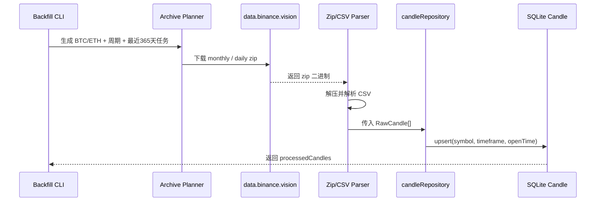

# Binance 官方历史 K 线回填 Light Spec

日期：2026-04-12  
状态：待 HARD-GATE 确认

## 1. 背景

- 当前分析页已经改为直接读取 `Candle` 表；实现位于 [readAnalysisCandles()](/Users/jiechen/per-pro/coin-hub/src/modules/market-data/read-analysis-candles.ts)，当库里没有数据时会返回“尚未同步市场数据。”。
- 当前在线采集入口位于 [createBinanceFuturesClient()](/Users/jiechen/per-pro/coin-hub/src/modules/market-data/binance-futures-client.ts) 与 [fetchAndStoreCandles()](/Users/jiechen/per-pro/coin-hub/src/modules/market-data/fetch-and-store-candles.ts)，但当前运行环境访问 `fapi.binance.com` 会命中 restricted location，实时拉取不可用。
- `Candle` 表已经对 `(symbol, timeframe, openTime)` 建立唯一约束，定义位于 [Candle](/Users/jiechen/per-pro/coin-hub/prisma/schema.prisma)；写库逻辑 [storeCandles()](/Users/jiechen/per-pro/coin-hub/src/modules/market-data/candle-repository.ts) 使用 `upsert`，天然支持重复回填。

## 2. 目标

使用 Binance 官方 `data.binance.vision` 历史归档，把分析页所需的真实 USD-M Futures K 线回填进 `Candle` 表，让 `/analysis` 立即能展示真实数据，而不依赖当前受限的实时 API。

## 3. 范围

### 3.1 本次要做

- 仅支持 `BTCUSDT`、`ETHUSDT`
- 仅支持 `15m`、`1h`、`4h`、`1d`
- 回填最近 `365` 天历史
- 数据源固定为 Binance 官方 `data.binance.vision`
- 导入方式为独立脚本/命令，手动执行
- 写入现有 `Candle` 表
- `source` 标记为 `binance-public-data`

### 3.2 本次不做

- 不解决实时行情同步
- 不修改分析页主结构
- 不新增回填进度表或复杂断点状态机
- 不扩到更多交易对和更多周期
- 不做“上市以来全量”历史

## 4. 方案

### 4.1 总体方案

新增一个独立的历史回填模块与手动命令：

1. 计算回填时间窗口：最近 365 天
2. 按 `symbol/timeframe` 生成所需月份与日期文件列表
3. 优先下载 `monthly` 归档，当前未结束月份补 `daily`
4. 解压 zip，解析 CSV 中的 OHLCV
5. 映射成现有 `RawCandle -> normalizeCandles() -> storeCandles()` 流程
6. 全部写入 `Candle`

### 4.2 数据流

## 5. 关键决策

### 5.1 不挂入 worker 常驻链

[runWorkerCli()](/Users/jiechen/per-pro/coin-hub/src/worker/index.ts) 当前在常驻模式下会同时启动作业调度与实时行情同步。历史回填是一次性、批量、耗时任务，不适合塞入常驻启动过程。  
因此本次做成**独立手动命令**。

### 5.2 只回填最近 365 天

[readAnalysisCandles()](/Users/jiechen/per-pro/coin-hub/src/modules/market-data/read-analysis-candles.ts) 只取最近 24 根；分析页当前的实际诉求是先有真实历史图，而不是做超长期回测。  
因此本次先回填最近 365 天，控制实现复杂度和导入时间。

### 5.3 使用 monthly + daily 混合

Binance 官方 `binance-public-data` 归档提供 monthly 与 daily 两套文件。为了减少下载次数与实现复杂度：

- 已结束月份：优先 monthly
- 当前未结束月份：补 daily

### 5.4 复用现有幂等写库

不新增新的 Candle 写入路径，直接复用 [storeCandles()](/Users/jiechen/per-pro/coin-hub/src/modules/market-data/candle-repository.ts) 的 `upsert`。  
这意味着：

- 可以重复执行
- 中断后可以直接重跑
- 不需要额外断点状态表

## 6. 成功标准

- 手动执行一次回填命令后，`Candle` 表新增 BTC/ETH 四个周期的真实历史 K 线
- `/analysis` 页面打开后不再显示“尚未同步市场数据。”
- 同一命令重复执行不会产生重复数据
- 至少覆盖最近 24 根可供分析页读取的真实 K 线

## 7. 风险

- `data.binance.vision` 只提供历史归档，不解决实时更新
- zip / CSV 解析需要处理 Binance 归档字段格式
- 某些日期文件可能不存在，下载逻辑需要能跳过空文件并继续
- 回填量虽然有限，但 `15m` 周期 365 天数据量仍明显高于其他周期，需注意导入批次与内存占用

## 8. 实现出口

预计新增：

- `src/modules/market-data/binance-public-data-client.ts`
- `src/modules/market-data/binance-public-data-parser.ts`
- `src/modules/market-data/backfill-historical-candles.ts`
- `scripts/backfill-historical-candles.ts`

预计复用：

- `src/modules/market-data/normalize-candles.ts`
- `src/modules/market-data/candle-repository.ts`

