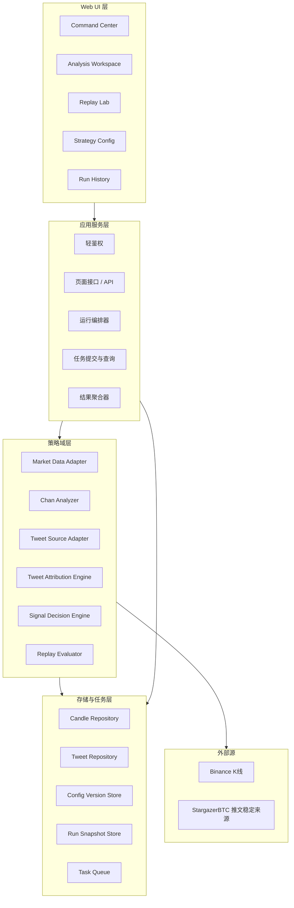
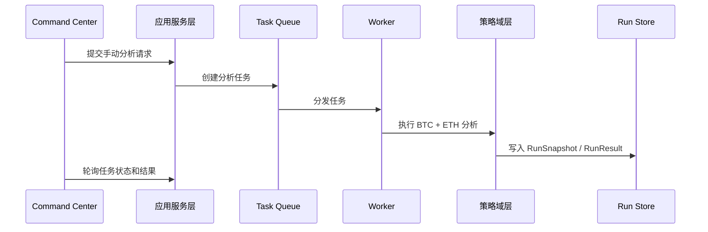

# Coin Hub 监测与交易策略控制台设计

## 1. 背景与目标

本项目第一阶段要构建一个面向 `BTC` 和 `ETH` 的监测与交易策略控制台。系统以 `Binance` 多周期 K 线为主数据源，结合缠论结构分析，并引入 `StargazerBTC` 的推文观点归因，最终通过 `Web UI 控制台` 输出可读、可追溯、可验证的交易结论。

第一阶段的目标不是自动下单，也不是完整交易平台，而是先建立一套：

- 能同时输出 `BTC` 和 `ETH` 结论的策略系统
- 能在 Web UI 中降低纯脚本使用成本的研究控制台
- 能把缠论结构、推文归因、最终信号放在同一上下文里理解的界面
- 能支持手动触发、定时运行、历史回放、参数版本化和结果追溯的基础设施

## 2. 范围

### 2.1 第一阶段包含

- 从 `Binance` 获取 `BTC` 和 `ETH` 的 `15m`、`1h`、`4h`、`1d` K 线
- 对多周期 K 线做标准化、校验、统一查询和重放
- 基于缠论生成结构化市场状态
- 从稳定来源获取 `StargazerBTC` 的推文或历史导出数据
- 使用“规则抽取 + LLM 解释”的方式生成推文观点归因
- 融合缠论结构和推文观点，生成交易信号
- 通过 Web UI 提供 `Command Center`、`Analysis Workspace`、`Replay Lab`、`Strategy Config`、`Run History`
- 支持轻鉴权，保护页面访问、配置编辑和手动触发
- 支持手动触发分析和定时运行
- 支持在页面上发起回放任务并查看结果
- 支持在页面上编辑参数并保存为新版本
- 记录运行快照、证据和告警，保证结果可追溯

### 2.2 第一阶段明确不包含

- 真实自动下单
- 欧易/币安等交易员开单监听
- 多用户账户系统
- WebSocket 级别的毫秒级实时推送
- 手工画线、自由标注、交互式调参预览
- 大规模参数寻优平台

## 3. 成功标准

第一阶段完成后，系统应满足以下结果：

- 每次运行默认同时分析 `BTC` 和 `ETH`
- Web UI 首页同时展示 `BTC` 和 `ETH` 当前结论，而不是要求用户先选资产
- 用户可以从控制台直接发起一次双资产分析
- 用户可以在控制台直接发起一条回放任务
- 用户可以在控制台查看和保存策略参数版本
- 研究页可以展示 `K 线 + 关键结构标记 + 推文观点时间点 + 最终信号`
- 推文源不可用时系统可降级为“仅 K 线分析”，并在 UI 和结果对象里显式标记
- 任一页面上的结论都能追溯到 `runId`、`strategyVersion`、输入证据和 warning
- 历史回放可以复现某一固定时间区间的结果和评估摘要

## 4. 总体设计原则

- 主数据优先：`Binance` K 线是主链路，推文数据是增强源
- 先事实、后结论：先形成缠论结构事实，再进入信号决策
- 统一决策出口：所有交易结论只能由信号决策器产出
- UI 只是消费和操作入口，不直接碰外部源
- 可降级但不失真：允许失去增强信息，不允许用坏主数据继续产出结论
- 页面与策略解耦：策略域层必须可脱离 Web UI 独立运行
- 实时链与验证链一致：手动分析、定时监测、历史回放复用同一分析与决策内核
- 无证据不算完成：输出必须带证据、告警和版本信息

## 5. 产品信息架构

### 5.1 一级页面

控制台包含 5 个一级页面：

1. `Command Center`
   首页，总控入口。负责同时展示 `BTC` 和 `ETH` 的当前结论、系统状态、最近运行摘要、回放摘要和快捷操作。

2. `Analysis Workspace`
   研究图表页。负责单资产深挖，展示多周期 K 线、结构标记、推文归因和最终结论。

3. `Replay Lab`
   回放实验页。负责选择时间范围、选择参数版本、提交新回放任务和查看结果摘要。

4. `Strategy Config`
   参数配置页。负责查看当前生效版本、编辑参数、保存新版本和查看版本记录。

5. `Run History`
   运行历史页。负责查看手动分析、定时运行、回放任务的历史记录，并下钻到双资产结果、证据和 warning。

### 5.2 页面边界

- 首页永远同时展示 `BTC + ETH`
- 研究页允许切换单资产和周期，但不改变首页双资产总览原则
- 回放和配置是一级页面，不隐藏在弹窗或脚本里
- 历史运行页不是日志页，而是结果与证据页

## 6. Web UI 关键交互

### 6.1 Command Center

首页包含以下区域：

- 顶部状态条：当前参数版本、最近运行时间、数据源健康、登录状态
- 双资产结论卡：`BTC` 和 `ETH` 当前方向、入场区、止损、止盈、置信度、结构摘要、推文状态
- 最近运行摘要：最近几次手动 / 定时分析的状态和 warning 数量
- Replay 摘要：最近一次回放的收益、命中率、失效样本数
- 风险与告警区：推文降级、数据异常、运行失败等高优先级问题
- 快捷操作区：`立即分析 BTC+ETH`、`发起回放`、`编辑配置`

关键交互：

- 点击 `立即分析`，默认同时发起 `BTC + ETH` 分析
- 点击 `BTC` 或 `ETH` 结论卡，进入 `Analysis Workspace` 并自动选中对应资产
- 点击 `发起回放`，跳转 `Replay Lab`
- 告警直接显示在首页，不要求用户先进入日志页

### 6.2 Analysis Workspace

研究页采用三栏布局：

- 左栏：资产切换和周期切换
- 中栏：主图区域，展示 `K 线 + 结构标记 + 信号点 + 推文观点时间点`
- 右栏：交易结论、证据面板、风险 / warning

关键规则：

- 图表上出现的结构或观点标记，右侧证据面板必须可解释
- 推文归因不是独立信息流，而是图表和证据的一部分
- 第一版不支持手工画线和自由标注

### 6.3 Replay Lab

回放页包含：

- 时间范围输入
- 参数版本选择
- 提交按钮
- 任务状态
- 结果摘要

关键规则：

- 回放按异步任务处理
- 回放结果必须绑定参数版本与时间范围
- 页面可以发起回放，但回放逻辑仍使用统一回放引擎

### 6.4 Strategy Config

配置页包含：

- 当前生效版本
- 可编辑参数表单
- 保存新版本入口
- 版本历史列表

关键规则：

- 每次保存都生成新版本
- 不允许无痕覆盖
- 新版本保存后可被后续手动分析和回放使用

### 6.5 Run History

历史页包含：

- 运行列表
- 单次 run 详情
- 双资产结果对象
- 输入证据和 warning

关键规则：

- 同一 run 下同时挂载 `BTC` 和 `ETH` 的结果
- 结果必须能看到降级、失败和 warning 原因
- 不只显示时间戳和状态

## 7. 全栈单体控制台架构

### 7.1 高层架构



### 7.2 分层说明

系统拆成 4 层：

1. Web UI 层
   负责页面展示、用户交互、状态反馈和导航。

2. 应用服务层
   负责鉴权、页面接口、任务编排、任务状态查询和结果聚合。

3. 策略域层
   负责 K 线分析、推文归因、信号生成和回放评估。

4. 存储与任务层
   负责持久化和异步任务执行。

### 7.3 本地与云上形态

- 本地运行时，可以是一体化进程或一体化容器
- 上云时，可以拆成 `web` 和 `worker` 两个部署单元
- 无论本地还是上云，页面接口和策略域层边界保持一致

## 8. 核心运行模式与状态流

### 8.1 同步请求

以下场景按同步请求处理：

- 登录校验
- 首页读取当前双资产结果
- 研究页读取图表、证据和结论
- 读取当前配置版本
- 读取历史 run 列表和详情

### 8.2 异步任务

以下场景按异步任务处理：

- 手动分析 `BTC + ETH`
- 定时监测
- 发起 replay
- 保存新配置后触发重新分析

### 8.3 手动分析流



### 8.4 Replay 流

Replay 与手动分析类似，但输入包含：

- 时间范围
- 参数版本
- 回放说明

回放完成后必须输出：

- 收益摘要
- 命中率
- 止损分布
- 失效样本说明
- 使用的参数版本

## 9. 核心组件设计

### 9.1 Market Data Adapter

职责：

- 从 Binance 获取 `BTC` 和 `ETH` 的 `15m`、`1h`、`4h`、`1d` K 线
- 将外部原始数据转换为统一 Candle 结构
- 执行基础校验

边界：

- 不做缠论分析
- 不做交易判断

### 9.2 Candle Repository

职责：

- 存储和查询标准化 Candle
- 支持实时分析与历史回放共用读取接口

### 9.3 Chan Analyzer

职责：

- 基于 Candle 构建缠论结构
- 输出分型、笔、线段、中枢、趋势方向和关键位

边界：

- 只输出结构事实
- 不直接给买卖结论

### 9.4 Tweet Source Adapter

职责：

- 从稳定来源抓取 `StargazerBTC` 推文
- 支持历史导入模式
- 返回原始推文和时间戳信息

边界：

- 数据源失败时允许空结果和告警
- 不阻塞主 K 线分析链

### 9.5 Tweet Attribution Engine

职责：

- 用规则抽取标的、方向、时间点、关键词和依据
- 用 LLM 生成归因摘要
- 输出结构化观点对象

边界：

- 是增强器，不是唯一决策器
- LLM 失败时允许回退为纯规则结果

### 9.6 Signal Decision Engine

职责：

- 融合 `ChanState` 和 `AttributedViewpoint`
- 统一生成交易信号
- 负责置信度、失效条件、证据聚合和风险提示

边界：

- 所有交易结论只能从这里产出
- 页面组件不得直接拼结论

### 9.7 Analysis Run Orchestrator

职责：

- 接收手动分析和定时监测请求
- 在同一轮 run 中编排 `BTC` 和 `ETH`
- 做资产级失败隔离

边界：

- 只编排流程，不产出市场判断

### 9.8 Result Aggregator

职责：

- 汇总同一轮 run 中的双资产结果
- 输出页面可消费的顶层结果对象
- 聚合 run 级 warning、版本和状态

### 9.9 Replay Evaluator

职责：

- 用同一分析内核做历史回放
- 生成回放评估报告

### 9.10 Auth Guard

职责：

- 为页面访问、配置编辑、手动分析和回放提交提供轻鉴权保护

边界：

- 只处理单用户访问控制
- 不扩展到多用户权限系统

## 10. 核心数据模型

### 10.1 Candle

```json
{
  "symbol": "BTC",
  "timeframe": "1h",
  "openTime": "2026-03-31T12:00:00Z",
  "open": 82000,
  "high": 82600,
  "low": 81800,
  "close": 82400,
  "volume": 1234.56,
  "source": "binance"
}
```

### 10.2 ChanState

建议字段：

- `symbol`
- `timeframeStates`
- `fractals`
- `strokes`
- `segments`
- `zs`
- `trendBias`
- `keyLevels`
- `structureSummary`

### 10.3 AttributedViewpoint

建议字段：

- `tweetId`
- `symbol`
- `publishedAt`
- `bias`
- `reasoning`
- `evidenceTerms`
- `confidence`
- `sourceType`

### 10.4 TradeSignal

每个资产单独一份：

- `symbol`
- `generatedAt`
- `bias`
- `entryZone`
- `stopLoss`
- `takeProfitZones`
- `invalidation`
- `confidence`
- `evidence`
- `warnings`
- `strategyVersion`
- `tweetContext`

### 10.5 RunResult

这是顶层结果对象，用来承载一次运行的双资产输出，也是页面读取首页、研究页和历史详情的基础对象。

```json
{
  "runId": "run_20260401_220000",
  "mode": "manual",
  "generatedAt": "2026-04-01T22:00:00Z",
  "strategyVersion": "v3",
  "warnings": [],
  "assets": {
    "BTC": {
      "status": "ok",
      "signal": {
        "symbol": "BTC",
        "bias": "long",
        "entryZone": [82000, 82300],
        "stopLoss": 81500,
        "takeProfitZones": [[83200, 83600]],
        "invalidation": "跌破 81500 且结构走坏",
        "confidence": 0.76,
        "tweetContext": "enhanced",
        "evidence": ["4h 中枢上沿突破", "StargazerBTC 偏多观点"]
      }
    },
    "ETH": {
      "status": "degraded",
      "signal": {
        "symbol": "ETH",
        "bias": "wait",
        "entryZone": null,
        "stopLoss": null,
        "takeProfitZones": [],
        "invalidation": "等待结构确认",
        "confidence": 0.48,
        "tweetContext": "degraded",
        "evidence": ["1h 结构未确认"]
      },
      "warnings": ["tweet source unavailable"]
    }
  }
}
```

约束：

- 顶层结果按 `run` 组织，不直接暴露单资产数组
- `BTC` 与 `ETH` 分别拥有独立状态
- 即使一个资产失败，另一个资产仍可正常输出

### 10.6 ConfigVersion

建议字段：

- `versionId`
- `createdAt`
- `createdBy`
- `summary`
- `params`
- `isActive`

### 10.7 ReplayJob

建议字段：

- `jobId`
- `timeRange`
- `configVersion`
- `status`
- `submittedAt`
- `completedAt`
- `resultRef`

## 11. 页面视图模型与接口边界

### 11.1 首页视图模型

首页至少需要：

- 当前生效参数版本
- `BTC` 当前结论卡
- `ETH` 当前结论卡
- 最近运行摘要
- 最近回放摘要
- 高优先级 warning

### 11.2 研究页视图模型

研究页至少需要：

- 当前资产
- 当前周期
- K 线数据
- 结构标记
- 信号点
- 推文观点时间点
- 交易结论
- 证据面板
- warning 列表

### 11.3 接口边界

应用服务层至少需要提供以下能力：

- 获取首页当前双资产结果
- 提交手动分析任务
- 获取单资产研究详情
- 提交 replay 任务
- 获取 replay 任务状态和结果
- 获取配置版本列表和当前配置
- 保存新配置版本
- 获取 run 历史和 run 详情

## 12. 失败处理与风险控制

### 12.1 允许降级的失败

- 推文数据源不可用
- LLM 解释失败
- 单条推文解析失败

处理方式：

- 保留 K 线和缠论分析
- 在结果中标记 `tweetContext=degraded`
- 在 UI 和结果对象中显示 warning
- 对置信度做衰减

### 12.2 必须中断的失败

- K 线主数据缺失或不可信
- 多周期边界对齐失败
- 缠论结构无法构建

处理方式：

- 对对应资产停止生成信号
- 另一资产若正常，可继续输出
- 首页和历史页必须显示失败原因

### 12.3 UI 风险控制

- 不能因为某一异步任务未完成而阻塞整个控制台阅读
- 异步任务状态必须可见
- 参数修改必须带版本号
- 任意页面上的结论都要带 `runId` 和 `strategyVersion`

## 13. 验证设计

### 13.1 测试层级

- 单元测试：Candle 标准化、多周期对齐、规则抽取、缠论结构构建、信号生成
- 组件集成测试：K 线到 ChanState、推文到 AttributedViewpoint、输入到 RunResult 的链路
- API / 页面集成测试：首页读取、研究页读取、提交分析任务、提交回放任务、保存新配置
- 端到端验证：登录后查看首页、发起手动分析、查看研究页、保存新配置、发起回放、查看历史页
- 历史回放验证：固定区间回放并验证结果可复现

### 13.2 第一阶段必须提供的证据

- 至少 1 次手动分析任务的完整 UI 结果
- 至少 1 次定时分析后的首页展示结果
- 至少 1 次 replay 任务的页面结果
- 至少 1 次配置版本保存与切换证据
- 至少 1 次推文降级路径验证
- 至少 1 次 K 线主数据异常导致中断的验证
- 至少 1 个能从 UI 回溯到 `runId`、输入证据和 warning 的样例

## 14. Definition of Done

满足以下条件才算第一阶段完成：

- 首页同时展示 `BTC` 和 `ETH` 当前结论
- 研究页展示 K 线、结构标记、推文归因和信号结论
- 支持手动分析、定时监测、回放任务
- 支持轻鉴权
- 支持配置版本查看、编辑和保存
- 支持运行历史与结果追溯
- 关键失败路径有降级或中断验证
- 所有输出都带 `evidence`、`warnings`、`confidence`、`strategyVersion`
- 历史回放可执行且结果可复现

## 15. 后续扩展方向

以下内容明确放到后续阶段：

- 接入更多交易员观点源
- 接入欧易/币安交易员开单监听
- 更丰富的通知渠道
- 多用户账户和权限系统
- 更强的交互式图表能力
- 基于稳定验证体系后的自动下单评估

## 16. 当前设计中的明确假设

- 第一阶段默认分析资产固定为 `BTC` 和 `ETH`
- 推文源优先使用稳定来源；若无法持续获取，则允许切回导入模式
- 第一阶段采用全栈单体控制台形态，但要保留未来拆成 `web + worker` 的能力
- `BTC` 与 `ETH` 的运行成功或失败按资产粒度独立处理
- Web UI 是第一使用入口，但策略域逻辑仍需可脱离页面独立运行
